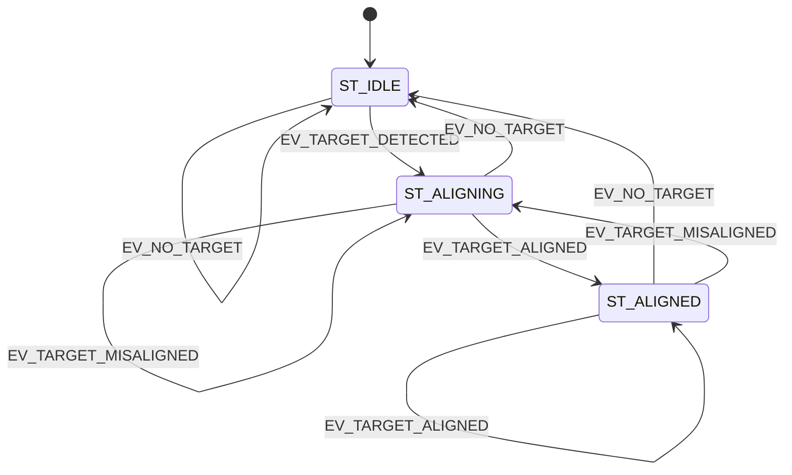

# Smart Mirror


Proyecto de espejo inteligente basado en ESP32. La idea central es que el
sistema detecte la posicion de una persona frente al espejo usando sensores
ultrasonicos y ajuste la orientacion del espejo con un servomotor.

El firmware esta organizado alrededor de una maquina de estados finitos (FSM),
lo que permite separar con claridad los estados del sistema, los eventos de
entrada y las acciones que se ejecutan sobre el servo.

## Objetivo

Construir un prototipo de Smart Mirror capaz de:

- Detectar presencia frente al espejo.
- Comparar lecturas entre dos sensores ultrasonicos.
- Determinar si la persona esta alineada.
- Mover un servo para corregir la orientacion del espejo.
- Simular el circuito completo en Wokwi antes de llevarlo a hardware real.

## Estado actual

El proyecto ya cuenta con:

- Configuracion de PlatformIO para `esp32doit-devkit-v1`.
- Framework Arduino sobre ESP32.
- Dependencia `madhephaestus/ESP32Servo`.
- Estructura de FSM con estados, eventos y tabla de transiciones.
- Diagrama de simulacion en Wokwi.
- Configuracion `wokwi.toml` para ejecutar el firmware compilado.

Pendiente de implementacion en `src/main.cpp`:

- Lectura real de los sensores HC-SR04.
- Logica de deteccion de persona.
- Logica de alineacion entre sensores.
- Movimiento gradual del servo hacia izquierda o derecha.
- Reemplazo de `delay(50)` por una estrategia no bloqueante.

## Hardware simulado

El diagrama de Wokwi incluye:

| Componente | Uso previsto |
| --- | --- |
| ESP32 DevKit V1 | Microcontrolador principal |
| 2 sensores HC-SR04 | Deteccion de distancia izquierda/derecha |
| Servo | Movimiento del espejo |
| LDR | Sensor de luz ambiente |
| 2 tiras LED de 8 pixeles | Iluminacion del espejo |
| Resistencias | Adaptacion y proteccion de senales |
| Breadboard | Conexionado del prototipo |

> Nota: el firmware actual usa la FSM, sensores ultrasonicos y servo como
> nucleo del sistema. La LDR y las tiras LED ya aparecen en el diagrama de
> Wokwi, pero todavia no estan integradas en el codigo.

## Maquina de estados



| Estado | Descripcion |
| --- | --- |
| `ST_IDLE` | El sistema no detecta una persona o permanece en reposo. |
| `ST_ALIGNING` | El espejo esta corrigiendo la orientacion. |
| `ST_ALIGNED` | La persona esta alineada con el espejo. |

| Evento | Descripcion |
| --- | --- |
| `EV_NO_TARGET` | No hay una persona detectada. |
| `EV_TARGET_DETECTED` | Hay una persona dentro del rango de deteccion. |
| `EV_TARGET_MISALIGNED` | La persona esta detectada, pero no alineada. |
| `EV_TARGET_ALIGNED` | La diferencia entre sensores esta dentro de la tolerancia. |

## Parametros principales

| Constante | Valor | Descripcion |
| --- | ---: | --- |
| `PERSON_DETECTION_THRESHOLD_CM` | `80.0` | Distancia maxima para considerar presencia. |
| `ALIGN_TOLERANCE_CM` | `5.0` | Diferencia maxima entre sensores para considerar alineacion. |
| `SERVO_CENTER_ANGLE` | `90` | Posicion central del servo. |
| `SERVO_MIN_ANGLE` | `0` | Angulo minimo permitido. |
| `SERVO_MAX_ANGLE` | `180` | Angulo maximo permitido. |
| `SERVO_STEP_ANGLE` | `2` | Incremento previsto para cada correccion. |

## Pines definidos en firmware

| Senal | GPIO |
| --- | ---: |
| Servo | `18` |
| Ultrasonico izquierdo TRIG | `5` |
| Ultrasonico izquierdo ECHO | `17` |
| Ultrasonico derecho TRIG | `16` |
| Ultrasonico derecho ECHO | `4` |

> Importante: si se modifica el cableado en Wokwi, tambien hay que actualizar
> estos `#define` en `src/main.cpp`.

## Requisitos

Para compilar, ejecutar y simular el proyecto se necesita:

- Visual Studio Code.
- PlatformIO IDE.
- Wokwi Simulator.

## Como ejecutar

1. Abrir el proyecto en Visual Studio Code.
2. Instalar las extensiones de PlatformIO y Wokwi Simulator.
3. Abrir el archivo `diagram.json`.
4. Ejecutar la simulacion con el boton de Wokwi desde el editor.

La ejecucion de la simulacion se inicia desde `diagram.json`. PlatformIO queda
como entorno de compilacion del proyecto y Wokwi usa `wokwi.toml` para ubicar
los archivos generados del firmware.

## Estructura del proyecto

```text
.
|-- diagram.json       # Circuito para Wokwi
|-- platformio.ini     # Configuracion de PlatformIO
|-- wokwi.toml         # Configuracion de simulacion
|-- src/
|   `-- main.cpp       # Firmware principal y FSM
|-- include/           # Headers del proyecto
|-- lib/               # Librerias privadas
`-- test/              # Tests de PlatformIO
```

## Notas de desarrollo

- Mantener sincronizados los pines definidos en `src/main.cpp` con el cableado
  de `diagram.json`.
- Evitar bloqueos largos en `loop()` para que la FSM pueda reaccionar rapido.
- Integrar LDR y tiras LED como mejoras futuras para controlar iluminacion.
- Usar el monitor serial para revisar las transiciones de estado durante la
  simulacion.
